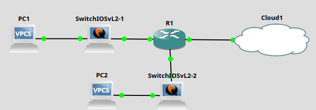

# Laboratory 3 - AAA, DHCP, NAT, Wireless
## I. Giới thiệu
- Hiểu và cấu hình mô hình xác thực AAA.
- Triển khai máy chủ DHCP và cấu hình cấp phát IP động.
- Cấu hình NAT (Static, Dynamic, PAT) trên router.
- Mô phỏng mạng không dây với bảo mật WPA2/WPA3.
## III. Cài đặt công cụ: 
Sử dụng các công cụ thực hành trước
## IV. Mô hình mạng thực hành:

## V. Nội dung thực hành
1. Cấu hình AAA (Authentication, Authorization, Accounting)
```
R1#conf t
R1(config)#aaa new-model
R1(config)#aaa authentication login default local
R1(config)#username admin secret 123456
```
Bật xác thực cho console và telnet/SSH:
```
R1(config)#line console 0
R1(config-line)#login authentication default
R1(config-line)#exit

R1(config)#line vty 0 4
R1(config-line)#login authentication default
R1(config-line)#transport input telnet ssh
R1(config-line)#exit
R1(config)#end
```
Kết quả: khi truy cập console hoặc Telnet → yêu cầu user/pass (admin/123456)
2. Cấu hình DHCP trên Router
```
R1#conf t
R1(config)#ip dhcp excluded-address 192.168.1.1 192.168.1.10  

R1(config)#ip dhcp pool LAN
R1(dhcp-config)#network 192.168.1.0 255.255.255.0
R1(dhcp-config)#default-router 192.168.1.1
R1(dhcp-config)#dns-server 8.8.8.8
R1(dhcp-config)#exit
```
Đảm bảo interface LAN đã có IP:
```
R1(config)#interface FastEthernet0/0
R1(config-if)#ip address 192.168.1.1 255.255.255.0
R1(config-if)#no shutdown
```
3. Cấu hình NAT (Internet giả định)
Mô hình NAT:
- Inside (LAN): 192.168.1.0/24
- Outside (Internet): Giả lập: dhcp
```
R1(config)#interface GigabitEthernet0/0
R1(config-if)#ip nat inside

R1(config)#interface GigabitEthernet0/1
R1(config-if)#ip address dhcp
R1(config-if)#ip nat outside
R1(config-if)#no shutdown
R1(config-if)#exit
R1(config)#end
R1#write memory
```
Cấu hình NAT overload:
```
R1(config)#access-list 1 permit 192.168.1.0 0.0.0.255
R1(config)#ip nat inside source list 1 interface Ethernet1/1 overload
```
NAT overload cho phép nhiều IP nội bộ chia sẻ 1 IP ra ngoài.

4. Cấu hình Wireless (mô phỏng)
- Vì GNS3 không có thiết bị AP nên dùng Switch mô phỏng có VLAN riêng cho Wi-Fi → tạo như mạng LAN bình thường.
```
Switch>enable
Switch#conf t
Switch(config)#vlan 20
Switch(config-vlan)#name WIFI
Switch(config-vlan)#exit

Switch(config)#interface gigabitEthernet0/1
Switch(config-if)#switchport mode access
Switch(config-if)#switchport access vlan 20
Switch(config-if)#no shutdown 
Switch(config-if)#exit
```
- Trên router, tạo subinterface cho VLAN 20:
```
R1(config)#interface Ethernet1/1.20
R1(config-subif)#encapsulation dot1Q 20
R1(config-subif)#ip address 192.168.20.1 255.255.255.0
R1(config-subif)#no shutdown 
R1(config-subif)#exit
```
- Cấu hình DHCP riêng cho VLAN 20:
```
R1(config)#ip dhcp pool WIFI
R1(dhcp-config)#network 192.168.20.0 255.255.255.0
R1(dhcp-config)#default-router 192.168.20.1
```
