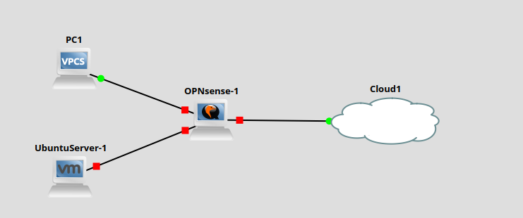

# Laboratory 5 - Secure network
## I. Giới thiệu
- Hiểu các nguyên tắc cơ bản trong thiết kế mạng an toàn.
- Cấu hình các thành phần bảo mật như phân vùng mạng (DMZ), NAT, firewall, ACL.
- Bảo mật dịch vụ (SSH, Web, FTP) bằng cấu hình và hardening.
- Tích hợp mô hình tấn công – phòng thủ mô phỏng.
## II. Công cụ:
- Sử dụng các công cụ bài tập trước
- OPNsense Firewall: [https://opnsense.org/download/](https://opnsense.org/download/)
## III. Cài đặt công cụ
- giống như Cisco IOSvL2 trong Lab2
## IV. Mô hình

LAN (em1): 192.168.10.0/24

DMZ (em2): 192.168.20.0/24

WAN (em0): 10.0.0.0/24
## V. Nội dung
1. Cài đặt OPNsense vào GNS3
- Giao diện LAN sẽ bật Web GUI mặc định: https://192.168.10.1
- User/pass mặc định: admin / opnsense
2. NAT cho LAN & DMZ
Mặc định, OPNsense bật NAT cho mạng LAN → Internet.

- Cấu hình NAT cho DMZ:

Vào Firewall > NAT > Outbound

Chuyển sang Hybrid Outbound NAT rule generation

Thêm rule:

Interface: WAN

Source: 192.168.20.0/24

Translation: Interface address

3. Firewall Rules
LAN → WAN (cho phép)

Firewall > Rules > LAN
```
Action: Pass
Source: LAN net
Destination: any
```
DMZ → WAN (giới hạn tùy bạn)
Firewall > Rules > DMZ
```
Action: Pass
Source: DMZ net
Destination: any (hoặc chỉ HTTP/HTTPS)

```
WAN → DMZ (chỉ mở port Web)

Firewall > NAT > Port Forward

Interface: WAN

Destination Port: 80

Redirect to: 192.168.20.10:80 (Web Server)

→ Tự động sinh rule trong Firewall > WAN

4. Cấu hình Web Server (DMZ)
Sử dụng Ubuntu hoặc VPCS để mô phỏng:
```
sudo apt update
sudo apt install apache2
ip addr add 192.168.20.10/24 dev ens3
```
5. Kiểm thử hệ thống
- PC1 (LAN): Ping 8.8.8.8 / Truy cập Web
- Web Server: Ping WAN / Truy cập internet
- Từ WAN (trình duyệt máy thật): Truy cập http://10.0.0.2

